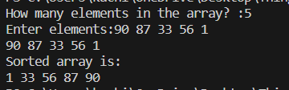

# Bubble-Sort
A Cpp code showing a sorting method known as bubble sort
## Theory
Bubble Sort Algorithm is the simplest sorting algorithm that works by repeatedly swapping the adjacent elements if they are in the wrong order. This algorithm is not suitable for large data sets as its average and worst-case time complexity is quite high.
### How it works
It compares the adjecent pairs and swaps the two if they are in the wrong order. After the First Iteration, the last value is guarenteed to be the right place so the next iteration goes till N-1th place.
Therefore the loop take (N(N-1))/2 comparisons to complete its sorting. (N=number of elements).
  The diagrammatic representation of bubble sort is:
 

## Explaination
We approach the code by using 2 loops. The outside loop is a while loop which runs *(however many elemts are there) number of times ie n times.
In the inside for loop (i), we run it from 0 to *(number of elements) - n , and we compare the elemenmts of the array of indices i and i+1, if theyre in the incorrect order, we swap them.

## Output Screenshot

